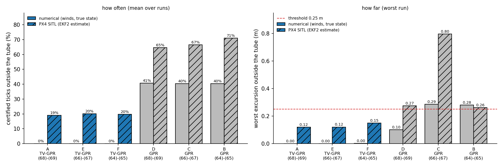
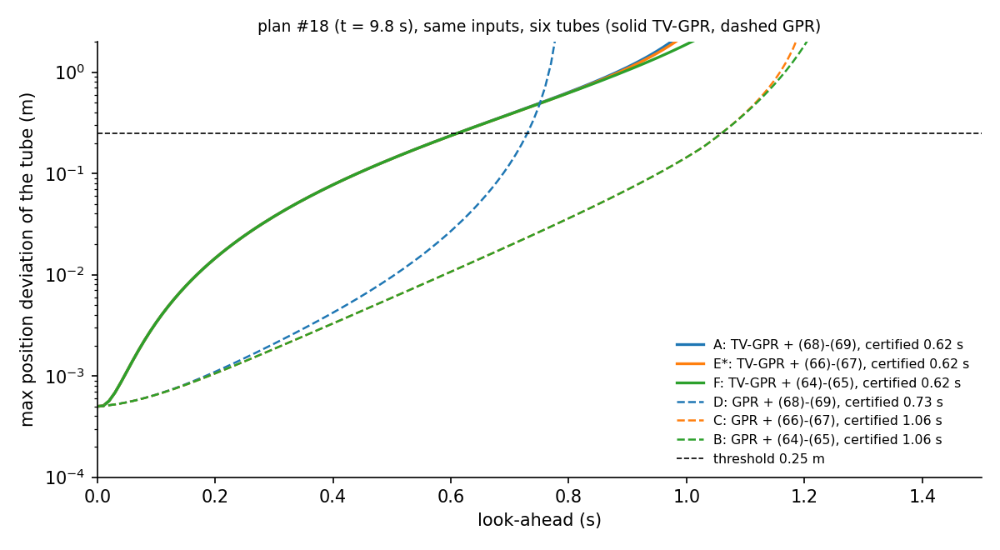

### Runtime Assurance with Mixed Monotonicity for Partially Unknown Systems with Gaussian Process Regressions for Quadrotor Hardware Deployment

A PX4 hardware-deployment-ready, JAX/immrax-based ROS 2 package for runtime assurance (RTA) of a quadrotor: a
reachable-tube certificate computed with mixed monotonicity around a reference trajectory, with the unknown wind
learned online by time-varying Gaussian processes. It builds on the numerical planar-quadrotor study of
[this paper](https://coogan.ece.gatech.edu/papers/pdf/cao2024tracking.pdf):

M. E. Cao and S. Coogan, "Trajectory Tracking Runtime Assurance for Systems with Partially Unknown Dynamics," 2024 IEEE
International Conference on Robotics and Automation (ICRA), Yokohama, Japan, 2024, pp. 11525-11531,
doi: 10.1109/ICRA57147.2024.10611237.

See videos [here](https://gtvault-my.sharepoint.com/:f:/g/personal/egm9_gatech_edu/IgCTC42sLm-LSrAf6xMkPS_UAev1dNpcvioJ8PtQfRRZTEs?e=mRaYgF).

## Key result: the time-varying GP is what keeps the certificate true

The certified tube is only as good as its disturbance model. We computed the tube six ways, the
**time-varying GP (TV-GPR)** of this package and a **time-invariant GP (GPR)**, each with the paper's three
embedding systems (Appendix A), all at the same certificate (position within 0.25 m of the reference,
0.3 m floor), and measured how often the vehicle actually **left** its certified tube:



**Time outside the certified tube** (numerical sim, wind: true state · PX4 SITL: EKF2 estimate):

| embedding system | **TV-GPR** (this package) | GPR |
|---|---|---|
| (68)-(69): first order in *u* and *w* | **A: 0 % · 19 %** (default) | D: 41 % · 65 % |
| (66)-(67): first order in *u* | **E: 0 % · 20 %** | C: 40 % · 67 % |
| (64)-(65): no first-order terms | **F: 0.03 % · 20 %** | B: 40 % · 71 % |

| | A | E | F | D | C | B |
|---|---|---|---|---|---|---|
| wind model + embedding | TV-GPR + (68) | TV-GPR + (66) | TV-GPR + (64) | GPR + (68) | GPR + (66) | GPR + (64) |
| numerical: worst excursion outside the tube | **0.9 mm** | **0.9 mm** | **1.2 mm** | 0.10 m | 0.29 m | 0.28 m |
| SITL: worst excursion outside the tube | **0.12 m** | **0.12 m** | 0.15 m | 0.27 m | 0.80 m | 0.26 m |
| SITL: tracking RMSE lateral / vertical | **20 / 27 mm** | **20 / 26 mm** | 20 / 30 mm | 24 / 32 mm | 27 / 42 mm | 27 / 42 mm |
| certified horizon (SITL, median) | 0.54 s | 0.54 s | 0.54 s | 0.78 s | 0.82 s | 0.84 s |
| one rollout (SITL, median) | 9.0 ms | 6.1 ms | 6.2 ms | 10.0 ms | 5.1 ms | 5.3 ms |

* **A static GP looks better and is wrong.** With every embedding system its tubes are about 10× thinner
  and certify further ahead, but a wind that drifts over time leaves it confidently wrong: in the
  numerical wind runs the true state is outside its "certified" tube about 40 % of the time, by up to
  0.29 m, more than the 0.25 m threshold itself.
* **With the time-varying GP the certificate holds**, with every embedding system: in all numerical wind
  runs the true state stayed inside its certified tube (worst 0.9-1.2 mm, from the 10 ms integration
  step), and the TV-GPR variants track best.
* **The embedding system barely matters once the GP is right.** With TV-GPR, (68)-(69), (66)-(67) and
  (64)-(65) certify the same horizon with the same tube widths: the GP's growing uncertainty over the
  look-ahead dominates the tube's growth, and for this vehicle (64)-(65) coincides with (66)-(67). The
  cheapest, (66)-(67), saves about a third of the rollout time.
* **In SITL** the full PX4 vehicle differs from the planar model (fast descent), so even the TV-GPR
  estimates leave the tube about 20 % of the time, but the ranking is the same and the GPR variants are
  3.3-3.6× worse with the same embedding. None of the 18 SITL flights needed the LAND backup.



Setup: 10 numerical cases per variant (calm, paper winds ×0.3 / ×0.6 / ×1.0 with 3 seeds; backup off, so
every variant flies the full mission) and 3 PX4 SITL flights per variant (backup on); δ = 0. All tables,
the GP × embedding grids, the two-way effect split and per-flight data:
[`05_embedding_comparison.ipynb`](packages/px4_rta_mm_gpr/scripts/data_analysis/05_embedding_comparison.ipynb).
Reproduce: `--gp tv|static --embedding uw|u|none` (node) or `SimConfig(gp_epsilon=..., embedding=...)`.

## Branches

| branch | what it is |
|---|---|
| **`main`** | the multithreaded Python node (this README) |
| **`cpp-version`** | `main` + a C++ fast loop: PX4 I/O, the 100 Hz control law and the certification watchdog in C++, with this Python node as the planner. Same features and tuning; faster and isolated by construction |
| tags `archive/*` | earlier branches, kept for reference: `archive/main-2026-05-02` (the single-threaded code the paper's hardware experiments were flown with), `archive/multithreaded`, `archive/cpp-fast-loop`, `archive/working_z`, `archive/working_last_y` |

## What the node does

* **Control:** Newton-Raphson tracker (pitch, yaw) + RTA feedback around the certified plan (thrust, roll rate),
  100 Hz body-rate setpoints to PX4 offboard.
* **Certification:** each rollout integrates an interval embedding of the planar dynamics with the GP wind
  bounds, and certifies the reference until the tube's **position** bounds (y, altitude) are more than 0.25 m + δ from
  the reference position or the tube dips below a **ground floor** (0.3 m). δ is the position-estimate uncertainty:
  0 in simulation, 3σ of EKF2's position estimate on hardware (it also widens the tube's initial box). Velocity and
  attitude bounds are not limited. The next rollout starts *before* the current certificate expires. If no certified plan exists for 20 ms,
  the node hands the vehicle to **PX4 LAND**.
* **Wind:** EKF on the acceleration residual at 100 Hz while the node's own commands fly. The y-wind is learned
  as a function of altitude and the z-wind as a function of lateral position. The GP mean is fed forward into the
  reference thrust.
* **Concurrency:** five callback groups on a `MultiThreadedExecutor` (or `EventsExecutor`). Rollouts can run in a
  worker process. Every in-flight JAX function is **ahead-of-time compiled** (it can never recompile mid-flight);
  rollouts stop at the certification point (3–7 ms instead of 60–190 ms).
* **Logging:** [flight_recorder](https://github.com/evannsmc/flight_recorder) (git submodule): one HDF5 file per
  flight, every plan stored once in full, autosaved every 5 s.

## Repository layout

```
docs/                       design notes and SITL results (Quarto sources + PDFs in docs/_output/)
packages/
  px4_rta_mm_gpr/           the ROS 2 package
    px4_rta_mm_gpr/         library: jax_mm_rta (model, GP, rollouts), jax_nr, concurrency, control_kernels,
                            flight_log, sim (numerical simulation), analysis (log analysis)
    scripts/                the node (rta_mm_gpr_node.py, px4_rta_mm_gpr.py) and data_analysis/ (notebooks)
    launch/                 sim_rta_launch.py
  flight_recorder/          git submodule: flight-data logging library
tools/run_sitl.sh           PX4 SITL with this project's parameters
```

## Build and run

```bash
git clone --recurse-submodules https://github.com/evannsmc/PX4_RTA_MM_GPR.git   # into <workspace>/
sudo apt install libhdf5-dev python3-h5py
pip install --user immrax control imageio-ffmpeg  # see docs/02 for the numpy 1.26 / ROS Jazzy caveats
colcon build --symlink-install --base-paths PX4_RTA_MM_GPR/packages <other deps: px4_msgs>
source install/setup.bash

PX4_RTA_MM_GPR/tools/run_sitl.sh                 # terminal 1: PX4 SITL + Gazebo x500 (HEADLESS=1 for no window)
MicroXRCEAgent udp4 -p 8888                      # terminal 2
ros2 launch px4_rta_mm_gpr sim_rta_launch.py         # terminal 3 (or: ros2 run px4_rta_mm_gpr px4_rta_mm_gpr --sim --log-file run.log)
```

`ros2 run px4_rta_mm_gpr px4_rta_mm_gpr --help` lists every option. The recommended configuration is
`--executor events --rollout-backend process`.

Numerical simulation without ROS or PX4:

```python
from px4_rta_mm_gpr.sim import SimConfig, simulate, paper_winds
result = simulate(SimConfig(duration=20.0), winds=paper_winds(scale=1.2), log_path='sim.h5')
```

## Data analysis

`packages/px4_rta_mm_gpr/scripts/data_analysis/` has notebooks for flight logs and numerical simulations (summary and
timing, tubes, videos of every plan's reachable tube with the GPs, numerical studies); see its README. The paper's **hardware** logs are in
`data_analysis/log_files/hardware/`, kept exactly as recorded. They come from the previous version of the code (tag
`archive/main-2026-05-02`).

## Documentation (`docs/_output/`)

0. **`00_package_guide.pdf` (start here)**: how the package is laid out and how its parts connect, ahead-of-time
   JAX compilation, the threads / processes / locks, and every import explained
1. `01_ros2_multithreading.pdf`: concurrency in ROS 2 / Python (executors, callback groups, GIL, processes, GC
   and JIT stalls)
2. `02_rta_node_changes.pdf`: the multithreaded node, its options, benchmarks, flight recorder
3. `03_compilation_rollouts_wind.pdf`: AOT compilation, early-exit rollouts, wind estimation, what caused the
   crashes
4. `04_altitude_and_ground.pdf`: GP feedforward (altitude offset), ground floor in the certificate, LAND backup
6. `06_fixes_and_comparison.pdf`: five model fixes (feedback sign, Jacobian domain, row lookup, body-frame
   velocities, 100 Hz state) and the TV-GPR / GPR × embedding-system comparison

The C++ fast loop is documented on the `cpp-version` branch (`docs/_output/05_cpp_fast_loop.pdf`).
